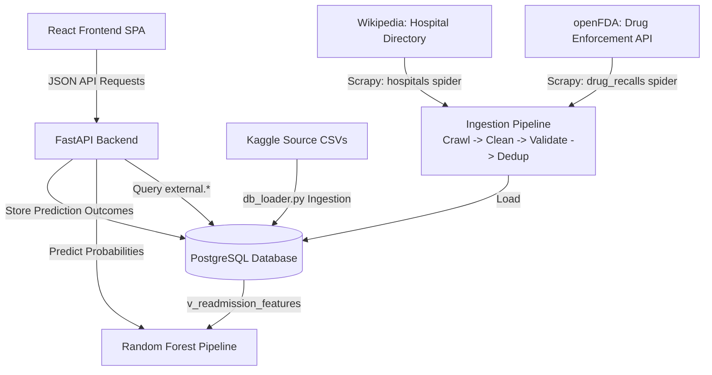

# MedScope — Hospital Intelligence & Predictive Analytics Platform

MedScope is an end-to-end, production-style healthcare intelligence and predictive decision-support platform. It ingests historical patient encounters, validates and statistically analyzes them, trains and explains a readmission-risk classification model, collects supplementary public healthcare data through a Scrapy-based ingestion pipeline, and serves everything through a FastAPI backend and a multi-page React dashboard.


---

## Table of Contents

- [Key Features](#-key-features)
- [Technology Stack](#️-technology-stack)
- [System Architecture](#-system-architecture)
- [Machine Learning & Model Performance](#-machine-learning--model-performance)
- [Installation & Running Instructions](#-installation--running-instructions)
- [External Data Ingestion Pipeline](#-external-data-ingestion-pipeline)
- [Frontend Application](#-frontend-application)
- [Testing](#-testing)
- [Repository Directory Layout](#-repository-directory-layout)
- [Responsible AI, Limitations & Validation](#️-responsible-ai-limitations--validation)

---

## 🚀 Key Features

*   **ETL Ingestion Pipeline**: Ingests, normalizes, and indexes ~120,000 patient records across 5 relational CSV files into PostgreSQL (staging → core → analytics schemas).
*   **Data Quality Validation**: Runs 22 automated integrity checks to verify completeness, uniqueness, validity, referential integrity, and consistency.
*   **Statistical Inference Engine**: Performs two-sample T-tests and Chi-square tests of independence to evaluate clinical correlations before they're used as model features.
*   **Temporal ML Modeling**: Evaluates model performance using a chronological train/test split (Train: 2015–2022, Test: 2023–2024) to avoid future-data leakage.
*   **Explainable AI (XAI)**: Calculates global feature importance using SHAP tree explainers, surfaced in the dashboard as model risk drivers.
*   **REST API**: FastAPI backend with 11 endpoints, Pydantic-validated inputs, and prediction/ingestion logging to PostgreSQL.
*   **Multi-Page Dashboard**: A React (Vite) single-page application — Dashboard, Patient Risk explorer, Patient Detail, Analytics, Data Pipeline, Ingestion Monitor, Predictions, and Settings — with a collapsible sidebar, light/dark theme, animated metrics, sparklines, and Recharts visualizations.
*   **External Data Ingestion Pipeline**: A production-style Scrapy pipeline that collects a public hospital directory (Wikipedia) and drug recall data (openFDA), then parses, cleans, validates, deduplicates, and loads it into a dedicated `external` PostgreSQL schema. See [External Data Ingestion Pipeline](#-external-data-ingestion-pipeline) below.
*   **Automated Test Suite**: 56 pytest tests covering parsing, cleaning, validation, deduplication, crawler behaviour, and API endpoints.
*   **Multi-Container Deployment**: Fully Dockerized environment using Docker Compose to spin up PostgreSQL, the FastAPI backend, and the Nginx-served frontend with one command.

---

## 🛠️ Technology Stack

*   **Database**: PostgreSQL 15, SQLAlchemy, Psycopg2
*   **Data Science & ML**: Python 3.12, Pandas, NumPy, SciPy, Scikit-learn, XGBoost, SHAP, imbalanced-learn
*   **Web Scraping / Ingestion**: Scrapy 2.11+ (spiders, downloader middlewares, AutoThrottle, subprocess-isolated crawls)
*   **Backend Server**: FastAPI, Uvicorn, Pydantic
*   **Frontend UI**: React 19 (Vite), React Router, Recharts, Lucide Icons, hand-rolled CSS design system with light/dark theming
*   **Testing**: pytest (56 tests), FastAPI `TestClient`
*   **Infrastructure**: Docker, Docker Compose, Nginx

---

## 📈 System Architecture



For a comprehensive review of schema components, see **[Architecture Specifications](docs/architecture.md)**.

---

## 🧬 Machine Learning & Model Performance

Four classifiers were trained on the same feature set and compared on the temporal test set (excluding data-leaking post-discharge fields):

| Model | F1-Score | Recall | Precision | ROC-AUC |
|---|---|---|---|---|
| Logistic Regression | 0.3628 | 0.6744 | 0.2481 | 0.7493 |
| Decision Tree | 0.3216 | 0.5981 | 0.2199 | 0.6828 |
| **Random Forest (Selected)** | **0.3672** | **0.5654** | **0.2718** | **0.7417** |
| XGBoost | 0.3431 | 0.5662 | 0.2461 | 0.7110 |

*   **Decision Threshold**: Tuned at `0.5` after evaluating 7 candidate thresholds, balancing screening recall against administrative precision.
*   **Global Explanations**: SHAP tree analysis identifies hospital tier, previous admissions, admission type, and the Charlson Comorbidity Index as the primary global risk drivers.
*   **Statistical grounding**: Readmitted patients stay 10.25 days on average vs. 6.39 days for non-readmitted patients — a statistically significant difference (T-test, p < 0.0001) — validated before being used as a model feature.

For complete hyperparameter details, see the **[Model Card](docs/model_card.md)**, **[SHAP Summary Plot](docs/shap_summary.png)**, and **[Statistics Report](docs/statistics_report.md)**.

---

## 📋 Installation & Running Instructions

### Prerequisites
*   [Python 3.12+](https://www.python.org/downloads/)
*   [PostgreSQL 15+](https://www.postgresql.org/download/)
*   [Node.js v18+](https://nodejs.org/)
*   [Docker Desktop](https://www.docker.com/products/docker-desktop/) (optional, for the one-command setup)

---

### Option A: Running with Docker (Recommended)

Spins up PostgreSQL, the FastAPI backend, and the React frontend served via Nginx with a single command:

1.  Copy `.env.example` to `.env` and adjust values if needed.
2.  Verify that Docker Desktop is running.
3.  Open your terminal in the root directory and run:
    ```bash
    docker compose up --build
    ```
4.  Access the services:
    *   **React Frontend Dashboard**: http://localhost:3000
    *   **FastAPI Swagger Docs**: http://localhost:8000/docs
    *   **PostgreSQL Instance**: Port `5432`

---

### Option B: Local Installation (no Docker)

#### 1. Setup the Database & ETL Ingestion
1.  Verify that your local PostgreSQL instance is running.
2.  Configure your credentials in the `.env` file (copy from `.env.example` if not present).
3.  Install Python packages:
    ```bash
    pip install -r requirements.txt
    ```
4.  Rebuild the schemas and run the ingestion loader:
    ```bash
    python src/data/db_loader.py
    ```
    This also provisions the `external` schema (`sql/09_external_ingestion.sql`) used by the
    Scrapy ingestion pipeline described in [External Data Ingestion Pipeline](#-external-data-ingestion-pipeline).
5.  (Optional) Populate the external ingestion tables with real scraped/API data:
    ```bash
    python -m src.ingestion --source all --mode full
    ```

#### 2. Run Data Quality & Statistical Analysis
```bash
python -m src.data.validation
python -m src.data.stats_analysis
```

#### 3. Train the Machine Learning Models
Generate the serialized pipelines (`models/model.pkl`), `feature_schema.json`, `model_metadata.json`, and SHAP artifacts:
```bash
python -m src.models.train
```

#### 4. Run the Unit Tests
```bash
python -m pytest
```

#### 5. Run the FastAPI Web Server
```bash
python -m uvicorn backend.app.main:app --host 127.0.0.1 --port 8000
```
API documentation is served at http://127.0.0.1:8000/docs.

#### 6. Run the Vite-React Frontend
In a new terminal window:
```bash
cd frontend
npm install
npm run dev
```
Open http://localhost:5173 in your browser to interact with the dashboard.

---

## 🌐 External Data Ingestion Pipeline

MedScope includes a standalone, production-style ingestion pipeline (`src/ingestion/`) built on **Scrapy**
that pulls **public, non-authenticated, non-sensitive** healthcare-related data from the web and loads it
into its own `external` PostgreSQL schema — completely separate from the `core.*` tables that back the
120k-record readmission dataset and ML model, so the existing ETL/analytics pipeline can never be broken by it.

### Pipeline stages

```
Source (Wikipedia / openFDA) -> Crawl (Scrapy spider: download + CSS/XPath selectors)
  -> Raw storage (data/raw/external/, via downloader middleware)
  -> Clean (normalize) -> Validate (required fields/types, with rejection reasons)
  -> Deduplicate (SHA-256 content hash) -> Load (PostgreSQL upsert) -> FastAPI -> React dashboard
```

Every stage is implemented in its own module for reuse and testability:

| Module | Responsibility |
|---|---|
| `config.py` | Environment-driven settings and the source registry |
| `scraper/settings.py` | Scrapy settings: User-Agent, robots.txt, retries, timeout, AutoThrottle |
| `scraper/spiders/` | One spider per source (`hospitals`, `drug_recalls`): download + extract |
| `scraper/items.py` | Declares the fields each spider is allowed to yield |
| `scraper/middlewares.py` | Archives every raw response before the spider parses it |
| `scraper/runner.py` | Runs a spider in an isolated subprocess, returns its items |
| `sources.py` | Maps a pipeline source name to the spider (and arguments) that serves it |
| `raw_storage.py` | Writes untouched raw HTML/JSON to `data/raw/external/<source>/` |
| `parsers.py` | Selector-based extraction: Scrapy response → plain dict records |
| `cleaning.py` | Whitespace/casing normalization, missing-value defaults |
| `validation.py` | Required-field/type checks, rejects bad records with a reason |
| `dedup.py` | SHA-256 content hashing; collapses in-batch duplicates |
| `db.py` | Upserts into `external.*`, writes `external.ingestion_runs` |
| `pipeline.py` | Orchestrates Crawl→Clean→Validate→Dedup→Load for one source |
| `__main__.py` | CLI entry point (`python -m src.ingestion`) |

### Sources

1.  **Hospital directory (web scraping)** — `https://en.wikipedia.org/wiki/List_of_hospitals_in_India`.
    Crawled by the `hospitals` Scrapy spider, which extracts rows with CSS/XPath selectors: the page has
    several `<table class="wikitable">` blocks (one per region), with inconsistent columns between tables
    (some omit "Type"/"Managed by"), so columns are matched by header name rather than fixed position — a
    realistic scraping challenge, not a toy fixture. Only a single, static, publicly-crawlable page is
    fetched; no login, no pagination-abuse, and the client identifies itself with a descriptive `User-Agent`.
2.  **Drug recalls (public REST API)** — `https://api.fda.gov/drug/enforcement.json`, the US FDA's
    openFDA API. No API key is required for the request volumes used here. `full` mode fetches the
    most recent N records; `incremental` mode queries only records reported after the latest
    `report_date` already stored (a real Lucene-syntax range query against the API), so re-running it
    only pulls what's new.

### Duplicate handling

Each record's key fields (e.g. hospital name + location + region, or event ID + recall number) are
hashed with SHA-256 into `record_hash`. In-batch duplicates are dropped before any DB call; at load
time, `record_hash` is `UNIQUE` and the loader does `INSERT ... ON CONFLICT (record_hash) DO UPDATE`,
so re-running ingestion is idempotent — existing rows get their `ingested_at` timestamp refreshed
instead of being duplicated.

### Errors & retries

Retries, timeouts and throttling are Scrapy settings rather than hand-written code:
`RetryMiddleware` retries connection errors, 429 and 5xx responses `RETRY_TIMES` times,
`DOWNLOAD_TIMEOUT` bounds every request, and AutoThrottle backs off when the server slows down — all
configurable via `.env` (`INGESTION_MAX_RETRIES`, `INGESTION_BACKOFF_FACTOR`,
`INGESTION_TIMEOUT_SECONDS`, `INGESTION_DOWNLOAD_DELAY`). `ROBOTSTXT_OBEY` is on by default.

Each crawl runs in its own subprocess (Twisted's reactor cannot be restarted in-process, and a hung
spider must not wedge the API server), bounded by `INGESTION_CRAWL_TIMEOUT_SECONDS`. When a crawl
fails, `runner.py` turns Scrapy's stats counters into a single `CrawlError` with a readable reason,
which the pipeline catches, logs, and records as a `FAILED` run in `external.ingestion_runs` (with the
error message) rather than crashing — no partial state is silently swallowed.

### Database

`sql/09_external_ingestion.sql` creates:

*   **`external.hospitals_directory`** — scraped hospital records, indexed on `region` and `hospital_type`.
*   **`external.drug_recalls`** — openFDA recall records, indexed on `classification`, `report_date`, `state`.
*   **`external.ingestion_runs`** — one row per pipeline execution (source, mode, discovered/parsed/cleaned/
    rejected/duplicate/inserted/updated counts, status, error message), indexed on `source` and `started_at`.

Both data tables carry ingestion metadata (`source`, `source_url`, `record_hash` (`UNIQUE`), `ingested_at`,
`ingestion_status`) for a traceable, auditable ingestion trail.

### API

| Endpoint | Description |
|---|---|
| `GET /external/hospitals?search=&region=&hospital_type=&page=&limit=` | Paginated, filterable hospital directory |
| `GET /external/drug-recalls?search=&classification=&state=&page=&limit=` | Paginated, filterable drug recall records |
| `GET /ingestion/stats` | Latest run per source + lifetime totals (powers the dashboard panel) |
| `GET /ingestion/runs?limit=` | Recent ingestion run history |
| `POST /ingestion/run?source=&mode=` | Manually trigger a pipeline run |

Example:
```bash
curl "http://127.0.0.1:8000/external/hospitals?region=Delhi&limit=5"
curl "http://127.0.0.1:8000/ingestion/stats"
```

`POST /ingestion/run` is **disabled by default** — it 403s unless the server has `INGESTION_API_KEY`
set in its environment, and the caller must send a matching `X-Ingestion-Key` header. This keeps
scraping/collection out of reach of unauthenticated public callers while still being triggerable by
an authorized operator or scheduler:
```bash
curl -X POST -H "X-Ingestion-Key: <your key>" \
  "http://127.0.0.1:8000/ingestion/run?source=drug_recalls&mode=incremental"
```

### Data quality

Every run reports: **Records discovered → parsed → cleaned → rejected → duplicate → inserted →
updated**. Rejections carry a human-readable reason (missing required field, invalid type, malformed
date, unexpected classification value, etc.) and are surfaced in the CLI output, the run log table,
and `/ingestion/stats`. Malformed HTML/JSON (e.g. a changed page structure or a truncated API
response) raises a `ParseError` before any DB write is attempted.

### Running

```bash
# Full ingestion of every configured source
python -m src.ingestion --source all --mode full

# Incremental ingestion for a single source
python -m src.ingestion --source drug_recalls --mode incremental

# Machine-readable summary
python -m src.ingestion --source hospitals --mode full --json
```

---

## 🖥️ Frontend Application

The dashboard is a componentized, multi-page React application (`frontend/src/`) built with React Router,
not a single monolithic page:

| Route | Page | Purpose |
|---|---|---|
| `/` | Dashboard | Live overview metrics, risk distribution, latest ingestion run, pipeline status |
| `/patient-risk` | Patient Risk | Searchable, paginated table of admission records |
| `/patient-risk/:admissionId` | Patient Detail | Full encounter record, prediction history, model risk drivers |
| `/analytics` | Analytics | Risk distribution, model comparison chart, ingestion trends, global SHAP importance |
| `/data-pipeline` | Data Pipeline | Crawl→Parse→Clean→Validate→Dedup→Load stage view + per-source data quality |
| `/ingestion` | Ingestion Monitor | Run history, run-detail funnel, manual trigger form, sample scraped records |
| `/predictions` | Predictions | Grouped input form → live `/predict` call → risk gauge + model drivers |
| `/settings` | Settings | Environment/API status, active model info, build metadata |

**Structure:**
```
frontend/src/
├── api/          # client.js (fetch wrapper, timeouts, typed errors) + endpoints.js
├── components/   # AppShell, Sidebar, TopBar, MetricCard, RiskBadge, RiskGauge,
│                 # RiskDistribution, PatientTable, PredictionForm, RiskExplanation,
│                 # PipelineStatus, IngestionStats, DataQuality, ChartCard, Hero,
│                 # Sparkline, AnimatedNumber, ThemeToggle, Loading/Empty/Error states
├── hooks/        # useApi (loading/error/data), useTheme (light/dark/system)
├── pages/        # One file per route, listed above
└── utils/        # format.js (numbers/dates/currency), admission→prediction mapping
```

Design notes: light/dark theme (persisted + OS-aware), animated metric counters, sparklines fed by real
ingestion-run history (never fabricated data — a metric hides gracefully rather than showing a fake
number when the backing endpoint has nothing yet), and Recharts for the model-comparison and ingestion-trend
charts.

---

## ✅ Testing

56 automated pytest tests, run with:
```bash
python -m pytest
```

| File | Tests | Covers |
|---|---|---|
| `tests/test_ingestion.py` | 38 | Parsing, cleaning, validation, deduplication, spider behaviour |
| `tests/test_ingestion_api.py` | 7 | `/external/*` and `/ingestion/*` FastAPI endpoints |
| `tests/test_ingestion_db.py` | 5 | Upsert/idempotency and DB health-check logic |
| `tests/test_api.py` | 4 | Core prediction/health API endpoints |
| `tests/test_model.py` | 2 | Model artifact presence and prediction sanity range |

External HTTP calls are mocked in tests — the suite never hits Wikipedia or openFDA over the network,
so it's fast and deterministic.

---

## 📁 Repository Directory Layout

```text
medscope/
├── backend/
│   ├── app/
│   │   ├── main.py            # API router and 11 endpoints
│   │   ├── schemas.py         # Pydantic schemas
│   │   ├── db/                # DB connections
│   │   └── services/          # Predict, preprocess & ingestion read services
│   └── Dockerfile
├── frontend/
│   ├── src/
│   │   ├── App.jsx            # Route table (React Router)
│   │   ├── api/                # HTTP client + typed endpoint calls
│   │   ├── components/         # Reusable UI building blocks
│   │   ├── hooks/               # useApi, useTheme
│   │   ├── pages/                # One component per route
│   │   ├── utils/                 # Formatting & mapping helpers
│   │   ├── index.css            # Design system & theme styles
│   │   └── main.jsx            # React app mount
│   ├── public/data/           # Real, build-time-copied model metrics / SHAP importance JSON
│   └── Dockerfile
├── src/
│   ├── data/
│   │   ├── db_loader.py       # Ingestion & staging script
│   │   ├── stats_analysis.py  # Statistical significance tests
│   │   └── validation.py      # Automated quality checks
│   ├── features/
│   │   └── engineering.py     # Temporal split + analytical view standardizer
│   ├── models/
│   │   └── train.py           # ML modeling pipeline
│   └── ingestion/              # External web scraping / API ingestion pipeline
│       ├── config.py           # Env-driven settings & source registry
│       ├── scraper/            # Scrapy project
│       │   ├── settings.py     # UA, robots.txt, retries, timeout, AutoThrottle
│       │   ├── items.py        # Declared fields per source
│       │   ├── middlewares.py  # Raw-payload archiving middleware
│       │   ├── runner.py       # Runs a spider in an isolated subprocess
│       │   └── spiders/        # hospitals.py, drug_recalls.py
│       ├── sources.py          # Maps a source name to its spider
│       ├── parsers.py          # Selector-based extraction -> dict records
│       ├── cleaning.py         # Normalization
│       ├── validation.py       # Record validation
│       ├── dedup.py            # Content-hash deduplication
│       ├── db.py               # external.* upserts & run logging
│       ├── pipeline.py         # Orchestration
│       └── __main__.py         # `python -m src.ingestion` CLI
├── sql/
│   ├── 01_create_schemas.sql
│   ├── 02_create_tables.sql
│   ├── 03_constraints.sql
│   ├── 04_indexes.sql
│   ├── 06_transformations.sql # ETL transformations
│   ├── 07_analytics_views.sql # Feature engineering view
│   ├── 08_ml_predictions.sql  # Prediction logging schema
│   └── 09_external_ingestion.sql # External ingestion schema (scraping/API)
├── models/                    # Serialized models and feature schemas
├── docs/                      # Model card, architecture, responsible AI, statistics report
├── tests/                     # 56 pytest tests across 5 files
├── requirements.txt
├── docker-compose.yml
└── README.md
```

---

## ⚖️ Responsible AI, Limitations & Validation

*   **Clinical safety**: MedScope is a decision-support prototype. It does not replace independent clinical judgment or make autonomous healthcare decisions.
*   **Target leakage**: Post-discharge and future-only indicators are explicitly excluded from the feature set, and the temporal (not random) train/test split prevents the model from ever training on data from after the test period.
*   **Known trade-off**: Precision (0.27) is intentionally lower than it could be — the decision threshold favors recall, because in a hospital screening context missing a genuinely high-risk patient is treated as more costly than a false alarm.
*   *Detailed guidelines*: **[Responsible AI Documentation](docs/responsible_ai.md)**

---

### Author

**Rudra Parmar** — Founder / Developer
