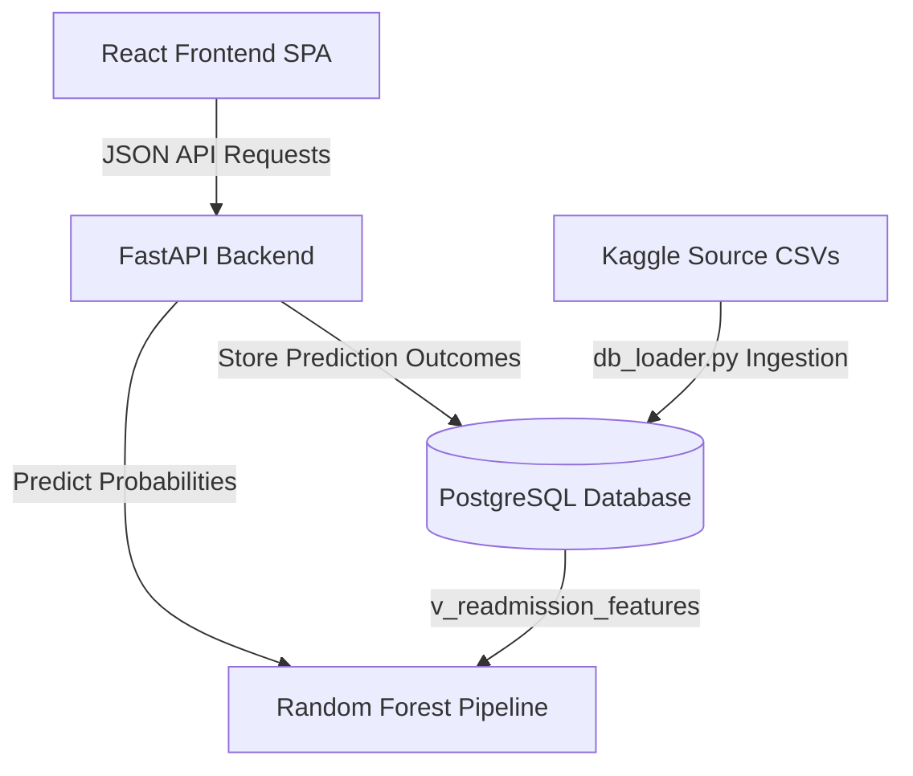

# MedScope — Hospital Intelligence & Predictive Analytics Platform

MedScope is an end-to-end, production-ready healthcare intelligence and predictive decision-support platform. The system is designed to analyze historical patient encounters, evaluate data quality, run statistical significance tests, train high-accuracy risk classification models, explain patient-specific risk drivers, and serve real-time predictions through a FastAPI service and a React single-page dashboard.


---

## 🚀 Key Features

*   **ETL Ingestion Pipeline**: Ingests, normalizes, and indexes ~120,000 patient records across 5 relational CSV files into PostgreSQL.
*   **Data Quality Validation**: Runs 22 automated integrity checks to verify completeness, uniqueness, and consistency.
*   **Statistical Inference Engine**: Performs two-sample T-tests and Chi-square tests of independence to evaluate clinical correlations.
*   **Temporal ML Modeling**: Evaluates model performance using a chronological train/test split (Train: 2015–2022, Test: 2023–2024) to avoid future leakage.
*   **Explainable AI (XAI)**: Calculates global feature importance and patient-specific risk drivers using SHAP tree explainers.
*   **REST API**: FastAPI backend verifying inputs with Pydantic schemas, calculating composite scores, and logging outputs to PostgreSQL.
*   **SPA Dashboard**: Responsive Vite-React interface using collapsible sidebar navigation, live aggregate stats, paginated patient logs, and custom-styled SVG visual charts.
*   **Multi-Container Deployment**: Fully Dockerized environments using Docker Compose to spin up DB, Backend, and Nginx-served Frontend.

---

## 🛠️ Technology Stack

*   **Database**: PostgreSQL 15, SQLAlchemy, Psycopg2
*   **Data Science & ML**: Python 3.12, Pandas, NumPy, Scipy, Scikit-learn, XGBoost, SHAP
*   **Backend Server**: FastAPI, Uvicorn, Pydantic, TestClient
*   **Frontend UI**: React (Vite), JavaScript, Vanilla CSS, Lucide Icons, Custom SVGs
*   **Infrastructure**: Docker, Docker Compose, Nginx

---

## 📈 System Architecture

The decoupled structure connects database staging, strict core relations, analytical views, serialized predictive pipelines, APIs, and client-side visualization:



For a comprehensive review of schema components, see the **[Architecture Specifications](file:///d:/DATA%20SCICENE%20PROJECT%20MAIN/docs/architecture.md)**.

---

## 🧬 Machine Learning & Model Performance

The modeling pipeline compares multiple classifiers on the temporal test set (excluding deceased patients to avoid leakage):

| Model | F1-Score | Recall | Precision | ROC-AUC |
|---|---|---|---|---|
| Logistic Regression | 0.3628 | 0.6744 | 0.2481 | 0.7493 |
| Decision Tree | 0.3216 | 0.5981 | 0.2199 | 0.6828 |
| **Random Forest (Selected)** | **0.3672** | **0.5654** | **0.2718** | **0.7417** |
| XGBoost | 0.3431 | 0.5662 | 0.2461 | 0.7110 |

*   **Decision Threshold**: Tuned at `0.5` to optimize the balance between screening recall and administrative precision.
*   **Global Explanations**: SHAP tree analysis identifies the Charlson Comorbidity Index, Length of Stay, and baseline previous admissions as the primary risk drivers.

For complete hyperparameter details, see the **[Model Card](file:///d:/DATA%20SCICENE%20PROJECT%20MAIN/docs/model_card.md)** and **[SHAP Summary Plot](file:///d:/DATA%20SCICENE%20PROJECT%20MAIN/docs/shap_summary.png)**.

---

## 📋 Installation & Running Instructions

### Prerequisites
*   [Python 3.12+](https://www.python.org/downloads/)
*   [PostgreSQL 15+](https://www.postgresql.org/download/)
*   [Node.js v18+](https://nodejs.org/)

---

### Option A: Running with Docker (Recommended)
Spins up PostgreSQL, the FastAPI backend, and the React frontend served via Nginx with a single command:

1.  Verify that Docker Desktop is running.
2.  Open your terminal in the root directory and run:
    ```bash
    docker compose up --build
    ```
3.  Access the services:
    *   **React Frontend Dashboard**: http://localhost:3000
    *   **FastAPI Swagger Docs**: http://localhost:8000/docs
    *   **PostgreSQL Instance**: Port `5432`

---

### Option B: Local Installation

#### 1. Setup the Database & ETL Ingestion
1.  Verify that your local PostgreSQL instance is running.
2.  Configure your credentials in the `.env` file (copy from `.env.example` if not present).
3.  Install Python packages:
    ```bash
    pip install -r requirements.txt
    ```
4.  Rebuild the schemas and run the ingestion loader:
    ```bash
    python src/data/db_loader.py
    ```

#### 2. Train the Machine Learning Models
Generate the serialized pipelines (`models/model.pkl`) and SHAP graphics:
```bash
python -m src.models.train
```

#### 3. Run the Unit Tests
Execute the testing suite to check schemas, connections, and prediction ranges:
```bash
python -m pytest
```

#### 4. Run the FastAPI Web Server
```bash
python -m uvicorn backend.app.main:app --host 127.0.0.1 --port 8000
```
API Documentation will be served at http://127.0.0.1:8000/docs.

#### 5. Run the Vite-React Frontend
In a new terminal window:
```bash
cd frontend
npm install
npm run dev
```
Open http://localhost:5173 in your browser to interact with the dashboard.

---

## 📁 Repository Directory Layout

```text
medscope/
├── backend/
│   ├── app/
│   │   ├── main.py            # API router and endpoints
│   │   ├── schemas.py         # Pydantic schemas
│   │   ├── db/                # DB connections
│   │   └── services/          # Predict & preprocess services
│   └── Dockerfile
├── frontend/
│   ├── src/
│   │   ├── App.jsx            # Core UI pages and navigation
│   │   ├── index.css          # Design system & theme styles
│   │   └── main.jsx           # React app mount
│   ├── public/                # Static assets (SHAP plots)
│   └── Dockerfile
├── src/
│   ├── data/
│   │   ├── db_loader.py       # Ingestion & staging script
│   │   ├── stats_analysis.py  # Statistical significance tests
│   │   └── validation.py      # Automated quality checks
│   ├── features/
│   │   └── engineering.py     # Analytical view standardizer
│   └── models/
│       └── train.py           # ML modeling pipeline
├── sql/
│   ├── 01_create_schemas.sql
│   ├── 02_create_tables.sql
│   ├── 03_constraints.sql
│   ├── 04_indexes.sql
│   ├── 06_transformations.sql # ETL transformations
│   ├── 07_analytics_views.sql # Feature engineering view
│   └── 08_ml_predictions.sql  # Prediction logging schema
├── models/                    # Serialized models and feature schemas
├── docs/                      # Model cards, responsible AI, & diagrams
├── tests/                     # Unit testing suites
├── requirements.txt
├── docker-compose.yml
└── README.md
```

---

## ⚖️ Responsible AI, Limitations & Validation

*   **Clinical safety**: MedScope is a decision-support prototype. It does not replace independent clinical judgment or make autonomous healthcare decisions.
*   **Target Leakage**: Expired patients and post-discharge indicators are explicitly filtered out before model training.
*   *Detailed Guidelines*: **[Responsible AI Documentation](file:///d:/DATA%20SCICENE%20PROJECT%20MAIN/docs/responsible_ai.md)**
